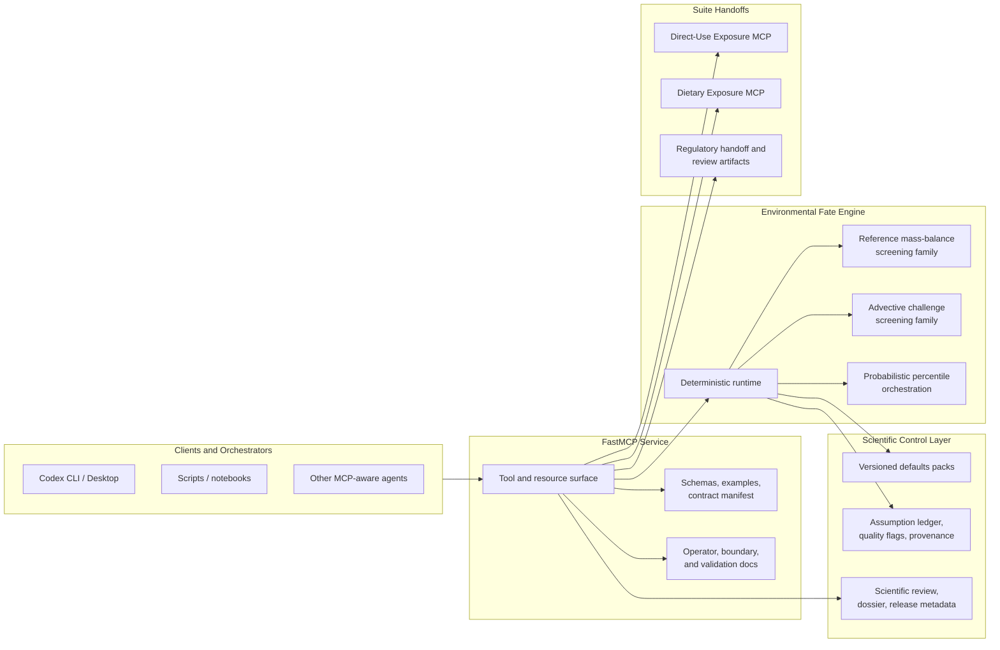

# Environmental Fate MCP

[](https://github.com/ToxMCP/environmental-fate-mcp/actions/workflows/ci.yml)
[](https://www.apache.org/licenses/LICENSE-2.0)
[](https://github.com/ToxMCP/environmental-fate-mcp/releases)
[](./docs/release_readiness.md)
[](https://www.python.org/)
[](https://modelcontextprotocol.io/)

> Part of **ToxMCP** Suite -> https://github.com/ToxMCP/toxmcp

**Governed MCP server for auditable environmental release-to-concentration screening, scientific review, and downstream regulatory handoff packaging.**
Environmental Fate MCP is one bounded module inside the broader ToxMCP suite. It turns environmental release assumptions into deterministic and bounded probabilistic concentration surfaces, scientific review packets, scientific methods dossiers, and downstream handoff artifacts without taking over direct human dose, dietary intake, PBPK execution, final risk characterization, or model-native external engine execution as the public contract.

## Architecture



The released server is broader than a simple concentration calculator, but the boundary is still strict:

- `Environmental Fate MCP` owns environmental release scenarios, multimedia concentration estimation, scientific review, scientific methods dossiers, and downstream concentration handoff packaging.
- `Direct-Use Exposure MCP` owns direct-use product scenarios, near-field external exposure construction, and PBPK-ready direct-use handoffs.
- `Dietary Exposure MCP` owns food-mediated oral intake, commodity-consumption mappings, and dietary PBPK-ready oral handoffs.
- `PBPK MCP` owns internal dose / toxicokinetic simulation after an external concentration or exposure object is already defined.
- The server is deterministic-first, with an additive probabilistic percentile lane and governed external-result normalization; it is not a general-purpose GIS dispersion engine, final-risk engine, or public wrapper around branded external model payloads.

## What's in v0.1.0

- Deterministic `reference_mass_balance` screening with finite-duration and bounded time-bucket concentration estimation
- Governed experimental `advective_screening_mass_balance` challenge family with residence-time, bounded-transport, loss-dominance, transition, mass-balance, and post-release authority layers
- Additive probabilistic percentile orchestration with median, P90, and P95 concentration surfaces plus failed-iteration taxonomy and reproducibility metadata
- Scientific review packets and briefs with equation, mass-balance, transport-regime, loss-transition, and post-release interpretation lines
- Scientific methods dossiers and briefs with governed claims, benchmark support, source grounding, highlighted claim digests, promotion status, and blocker/action posture
- Model-family selection, challenge, and comparison review workflows so experimental families remain challenge-path review surfaces rather than silent defaults
- Governed external-result adapter lane with semantic-loss classification, fail-closed blocking for non-equivalent imports, and provenance-preserving normalization
- Regulatory handoff packages, summaries, packets, and briefs for downstream suite consumers
- Published JSON schemas, examples, contract manifest, release metadata, validation artifacts, and defaults manifests

## Release snapshot

Current local release verification and generated `v0.1.0` artifacts report:

- `135` passing tests
- `107` JSON schemas
- `103` generated examples
- `39` supported workflows surfaced through `46` tools and `14` prompts
- `54` benchmark fixtures with claim-coverage enforcement
- `30` governed scientific validation claims with plugin-code traceability
- `25` governed scientific reference cases
- `4` governed regulatory handoff profiles with downstream acknowledgement schema URLs
- `3` supported model families and `1` experimental model family
- `ready_for_screening_release` release status

The machine-readable source of truth for these counts is generated from the release metadata and validation-report builders in the repository.

## Why this project exists

Environmental fate is often the least auditable layer in early NGRA orchestration: release assumptions may be implicit, concentration math may be hidden inside spreadsheets or notebooks, and downstream reviewers often receive conclusions without a machine-readable record of defaults, limitations, and governing claims.

Environmental Fate MCP gives the suite a dedicated environmental-fate layer that is:

- **deterministic-first** for transparent screening and reviewer-facing challenge use
- **governed** through versioned defaults packs, applicability profiles, validation claims, reference cases, and explicit limitations
- **auditable** with structured correlation-ID logging (optional JSONL file output via `FATE_MCP_AUDIT_LOG_PATH`) and tamper-evident SHA-256 integrity hashes on every concentration bundle and regulatory handoff package
- **MCP-native** with typed tools, resources, prompts, schemas, examples, request skeletons, and release artifacts
- **bounded** so it complements Direct-Use Exposure MCP, Dietary Exposure MCP, PBPK MCP, and downstream review services instead of claiming their responsibilities
- **fail-closed** on non-physical inputs (non-positive half-lives and residence times raise hard errors rather than being silently clamped)

## Feature snapshot

| Capability | Description |
| --- | --- |
| `🌍 Environmental release screening` | Builds typed environmental release scenarios and deterministic concentration surfaces for multimedia screening use cases. |
| `🌊 Advective challenge family` | Publishes a governed experimental residence-time and bounded-transport challenge path with explicit comparison and challenge review workflows. |
| `📊 Probabilistic percentile reporting` | Runs an additive percentile orchestration layer over the deterministic kernels and emits reviewable median, P90, and P95 surfaces plus iteration-health context. |
| `🧪 Scientific review surface` | Exports assessor-facing review packets and briefs with equation traces, mass-balance partitions, transport-regime lines, loss-transition cues, and post-release recovery interpretation. |
| `🧾 Scientific methods dossiers` | Publishes governed claim sets, source-grounding lines, benchmark support, highlighted claim digests, challenge posture, and promotion/blocker summaries for each model family. |
| `🔌 External adapter normalization` | Normalizes governed external-engine exports into canonical concentration contracts with semantic-loss disclosure and fail-closed blocking for non-equivalent mappings. |
| `🧭 Model-family challenge governance` | Exposes model-family selection, challenge, and comparison workflows so reference and experimental families remain reviewable under governed assessor logic. |
| `📦 Regulatory handoff packaging` | Exports concentration bundles, regulatory handoff packages, summaries, packets, and briefs for downstream suite consumers without claiming final risk decisions. |
| `✅ Validation and release surface` | Ships defaults manifests, schemas, examples, benchmark manifests, scientific-claim coverage and freshness reports, validation dossiers, and release-readiness reports as first-class outputs. |

## Release verification

Current validation artifacts report:

- `ready_for_screening_release` release status
- `0` uncovered mandatory scientific validation claims
- `0` stale claims without benchmark or code traceability
- deterministic example generation enforced for committed release artifacts
- server startup validates shipped artifacts without regenerating them
- deterministic and probabilistic review workflow parity enforced through validation
- adapter normalization, scientific review, scientific methods dossier, model-family challenge, and regulatory handoff workflows included in release gating
- scientific invariant tests proving mass-balance closure, advection bounds, mass linearity, and half-life monotonicity
- CI fails if generated artifacts or defaults manifest hashes drift from committed state, if the full release validator fails, or if startup validation cannot load the shipped artifacts

See:

- [docs/release_readiness.md](./docs/release_readiness.md)
- [docs/validation_framework.md](./docs/validation_framework.md)
- [docs/suite_integration.md](./docs/suite_integration.md)
- [CHANGELOG.md](./CHANGELOG.md)
- [MIGRATION.md](./MIGRATION.md)
- [docs/regulatory_quick_start.md](./docs/regulatory_quick_start.md)
- [docs/releases/v0.1.0/release-notes.md](./docs/releases/v0.1.0/release-notes.md)

## Governance

- [CONTRIBUTING.md](./CONTRIBUTING.md)
- [SECURITY.md](./SECURITY.md)
- [SUPPORT.md](./SUPPORT.md)
- [docs/releases/public_release_checklist.md](./docs/releases/public_release_checklist.md)

## Quick start

```bash
uv sync --extra dev
uv run environmental-fate-mcp-generate-artifacts
uv run environmental-fate-mcp-build-release-bundle
uv run pytest
uv run environmental-fate-mcp-validate
uv run environmental-fate-mcp
```

For regulatory deployments, enable durable JSONL audit logging:

```bash
export FATE_MCP_AUDIT_LOG_PATH="/var/log/fate-mcp/audit.jsonl"
uv run environmental-fate-mcp
```

Legacy CLI aliases remain available:

- `uv run fate-mcp`
- `uv run fate-mcp-generate-artifacts`
- `uv run fate-mcp-validate`

## Repository layout

- `src/fate_mcp/`: package code and MCP server surface
- `src/fate_mcp/integrations/`: review artifact builders (scientific review, model-family comparison/challenge, regulatory handoff)
- `defaults/v1/`: curated defaults, applicability profiles, scientific validation claims, and reference cases
- `docs/contracts/schemas/`: generated JSON Schema files
- `schemas/examples/`: generated example payloads
- `docs/releases/`: generated release bundles and release-documentation surface
- `docs/adr/`: architecture decisions
- `tests/`: runtime, defaults, validation, adapter, integration, invariants, and manifest-hash regression coverage

## Current limitations

- Not a direct-use product exposure engine
- Not a dietary intake engine
- Not a PBPK execution engine
- Not a GIS-resolved plume or hydrodynamic dispersion engine
- Not a general-purpose unrestricted probabilistic fate platform outside the governed percentile workflow
- Not a final regulatory decision engine or a claim of formal equivalence to submission portals

The detailed boundary and limitation notes are in [docs/fate_model_boundary_guide.md](./docs/fate_model_boundary_guide.md) and [docs/model_applicability_limits.md](./docs/model_applicability_limits.md).

## License

Apache License 2.0.
